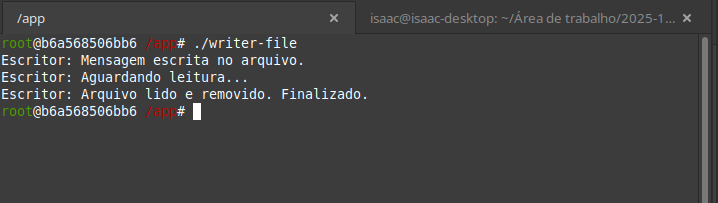
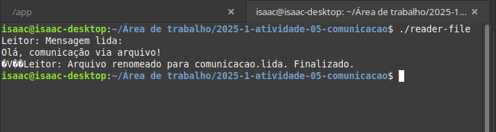
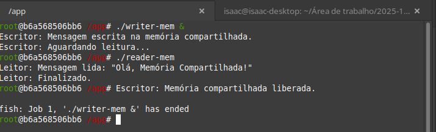
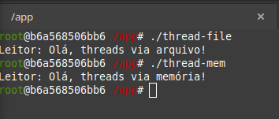

# 🖥️ **Relatório - Atividade 04: Comunicação entre Tarefas**

**Aluno:** Isaac Lira  
**Disciplina:** Sistemas Operacionais - IFRN CNAT  
**Professor:** Leonardo Minora

---

## 🎯 **1. Objetivo da Atividade**

O objetivo dessa atividade foi entender e testar na prática como funciona a **comunicação entre tarefas (processos)** no Linux. Foram feitos dois tipos de comunicação:

* Usando **arquivos** como meio de troca de informações
* Usando **memória compartilhada**

Depois disso, eu também fiz versões que usam **threads** no lugar de processos, pra comparar como muda o comportamento e a implementação.

---

### 🚀 **Dockerfile que eu usei:**

```Dockerfile
FROM fedora:latest

RUN dnf -y update && \
    dnf -y install \
    gcc \
    findutils \
    fish \
    glibc-devel \
    make \
    util-linux \
    htop \
    ncurses \
    && dnf clean all && \
    rm -rf /var/cache/dnf

RUN mkdir -p /app
WORKDIR /app

CMD ["fish"]
```

---

## 📂 **2. Comunicação por Arquivos**

### ✅ Como Funciona

* Um programa (escritor) cria um arquivo com uma mensagem.
* Outro programa (leitor) abre esse arquivo, lê o conteúdo e depois **renomeia o arquivo** como uma forma de dizer "li, pode seguir".

A comunicação basicamente acontece pelo próprio sistema de arquivos.

### 🧠 Como sincroniza?

* O escritor só segue quando percebe que o arquivo com o nome antigo não existe mais (usando `access()` no C).
* O leitor lê o arquivo e então renomeia, pra sinalizar que terminou.

### 🗒️ Códigos usados:

* `writer-file.c` (escritor)
* `reader-file.c` (leitor)

### 📸 Prints da execução:

| Escritor                                      | Leitor                                        |
| --------------------------------------------- | --------------------------------------------- |
|  |  |

---

## 📦 **3. Comunicação por Memória Compartilhada**

### ✅ Como Funciona

* O escritor cria um pedaço de memória que pode ser acessado por outro processo.
* Ele escreve a mensagem lá, e o leitor acessa essa mesma memória, lê e sinaliza que leu.

Tudo acontece na memória RAM, então é bem mais rápido que usar arquivos.

### 🗒️ Códigos usados:

* `writer-mem.c` (escritor)
* `reader-mem.c` (leitor)

### 📸 Print da execução (não consegui executar o leitor em outro terminal, então usei o mesmo para o escritor e leitor):

| Memória Compartilhada                           |
| ----------------------------------------------- |
|  |

---

## 🔄 **4. Versões Usando Threads**

### ✅ Como Funciona

Aqui eu simulei a mesma lógica das versões anteriores, mas dentro de um **único processo usando threads**. Como as threads compartilham a mesma memória do processo, não precisei fazer nada muito complexo pra elas se comunicarem.

### 🗒️ Códigos usados:

* `thread-file.c` (simula comunicação por arquivo, mas com threads)
* `thread-mem.c` (simula comunicação por memória, com threads)

### 📸 Print das threads rodando:

| Threads funcionando            |
| ------------------------------ |
|  |

---

## 🏁 **5. Conclusão**

* **Arquivos:** simples, prático, fácil de entender, porém,  meio lento.
* **Memória Compartilhada:** mais rápido, mas dá mais trabalho configurar e sincronizar.
* **Threads:** o mais rápido e fácil quando tá tudo dentro de um mesmo programa.
